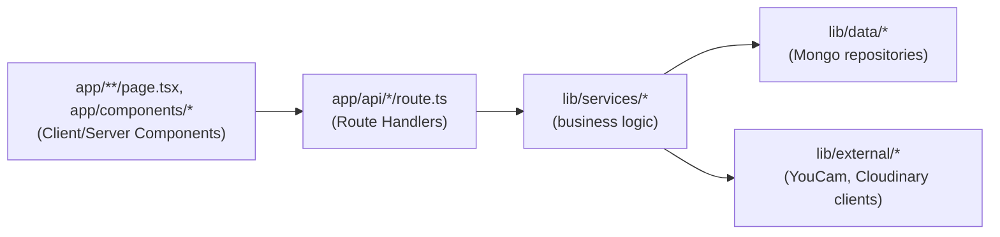
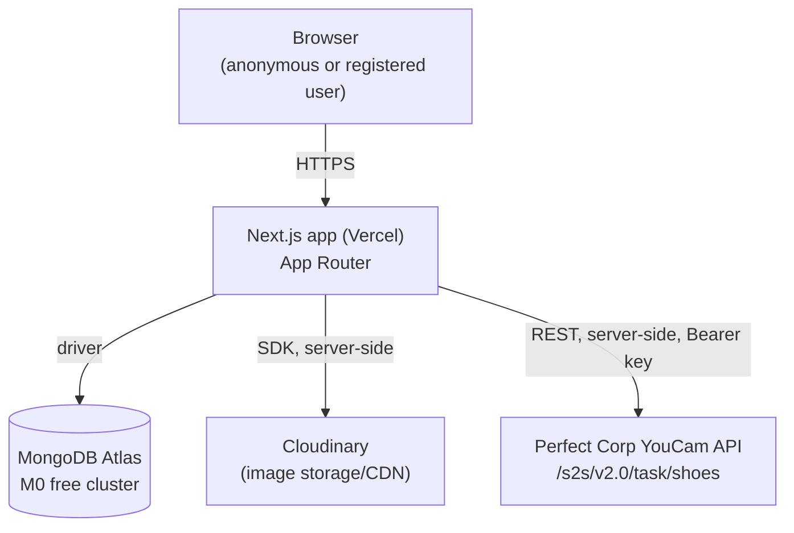
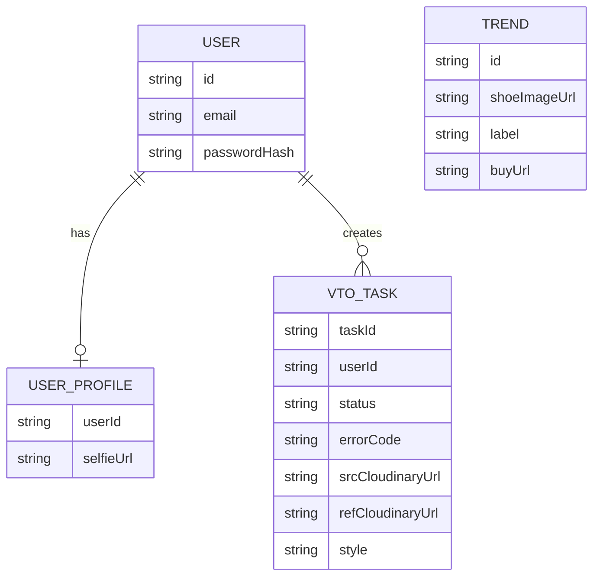

# Architecture Spine — What the Heel

## Design Paradigm

Layered architecture mapped onto Next.js App Router directories:

- **Route Handlers** (`app/api/*/route.ts`) — HTTP boundary only: parse/validate the request shape, call one service function, shape the response. No business logic, no direct SDK/driver imports.
- **Services** (`lib/services/*`) — business logic: VTO task orchestration, image validation, error-code-to-copy mapping, auth session checks. Plain TypeScript; never imports `next/server` request/response types, so it stays portable and unit-testable.
- **Data & External** (`lib/data/*` Mongo repositories, `lib/external/*` YouCam + Cloudinary clients) — the only layer permitted to import the MongoDB driver, the Cloudinary SDK, or call a YouCam endpoint directly.



Dependency direction is one-way: `app/**` (pages/components) → Route Handlers → Services → Data/External. A module in `lib/data/*` or `lib/external/*` must never import from `lib/services/*` or `app/*`.

## Invariants & Rules

### AD-1 — Server-only external calls

- **Binds:** FR-04, FR-06, all of `lib/external/*`
- **Prevents:** API keys (YouCam, Cloudinary) reaching the client bundle; a Client Component calling an external API directly
- **Rule:** YouCam, Cloudinary, and MongoDB access happens exclusively inside Route Handlers / Services / Data layer, running on the Node.js runtime (`export const runtime = 'nodejs'` where the default is ambiguous) — never inside a Client Component, never on the Edge runtime. Secrets (YouCam API key, Cloudinary API secret, MongoDB URI) must never use the `NEXT_PUBLIC_` prefix — that prefix inlines a value into the client bundle, which defeats this AD. `project-context.md`'s `NEXT_PUBLIC_...` example applies only to genuinely public, non-secret config.

### AD-2 — Single VTO task owner

- **Binds:** FR-04, FR-06
- **Prevents:** polling cadence or error-code-to-copy mapping being reimplemented differently in more than one place
- **Rule:** All VTO task creation/status logic lives in `lib/services/vtoTask.ts`, backed by exactly one `vto_tasks` MongoDB collection. The client only calls `POST /api/vto-tasks` and `GET /api/vto-tasks/[id]`; it never calls YouCam directly.

### AD-3 — Registered-only VTO, ownership-scoped

- **Binds:** FR-02, FR-04, Cost Management NFR
- **Prevents:** an anonymous session triggering a billed YouCam call; a service-layer caller (e.g. a future Server Component) bypassing the Route Handler's check; one registered user reading or acting on another user's VTO task
- **Rule:** The auth check and the ownership check both live inside `lib/services/vtoTask.ts` itself — not only in the Route Handler — so any caller path is gated, not just the HTTP entry point. `createVtoTask()` requires an authenticated session. `getVtoTaskStatus()` requires the session's user id to match the task's `userId`; a mismatch returns 404 (not 403, to avoid confirming the task exists). FR-02's manual overlay path never imports `lib/external/youcam.ts` or `lib/services/vtoTask.ts`.

### AD-4 — Image bytes vs. metadata split

- **Binds:** FR-03, FR-04
- **Prevents:** raw image bytes stored inside MongoDB documents (BSON caps at 16MB; selfies alone can be 10MB)
- **Rule:** Raw selfie/shoe image bytes are uploaded to Cloudinary via `lib/external/cloudinary.ts`. MongoDB documents store only the returned Cloudinary `secure_url`/`public_id` plus metadata — never binary image data.

### AD-5 — Single validation point

- **Binds:** FR-03, FR-04, Image Constraints NFR
- **Prevents:** format/size/dimension checks drifting between client and server, or being skippable
- **Rule:** Image validation (format, file size, dimensions per the PRD's Image Constraints table) happens exactly once, server-side, inside the upload Route Handler's service call, before any Cloudinary upload. Any client-side check is a UX hint only and is never authoritative.

### AD-6 — VTO failure handling contract

- **Binds:** FR-06
- **Prevents:** ad hoc, inconsistent error UI per call site; a bug-indicating code leaking to end users as if it were user-fixable
- **Rule:** Every YouCam error code maps to fixed handling in exactly one place (a co-located map in `lib/services/vtoTask.ts`). All codes except `invalid_parameter` render inline on the same screen (never a modal), with a retry action that re-opens the upload control. `invalid_parameter` is logged server-side only (it indicates a bug, not a user-fixable issue) and surfaces to the user as the same generic `error_inference` copy.

### AD-7 — Credentials-based auth ownership and session strategy

- **Binds:** FR-03, Story 2.1
- **Prevents:** a story assuming NextAuth's MongoDB adapter manages user creation/sessions (an OAuth-shaped assumption that doesn't hold for Credentials provider); two divergent password-verification implementations; database-session code that silently breaks because Credentials provider forces JWT
- **Rule:** Auth uses NextAuth's `CredentialsProvider` only (email + password), with `session: { strategy: 'jwt' }` — required by NextAuth v4, since Credentials provider is incompatible with database-persisted sessions (verified against NextAuth's own docs/FAQ). No adapter is used. The `users` collection is fully app-owned via `lib/data/users.ts`: written only by `POST /api/auth/register` (`id`, `email`, `passwordHash`, `createdAt`), read only inside `CredentialsProvider`'s `authorize()` callback. Passwords are hashed with `bcryptjs` — never stored plain, never compared without hashing.

## Consistency Conventions

| Concern | Convention |
| --- | --- |
| Naming (entities, files, interfaces, events) | React components: `PascalCase`, in `app/components/`. MongoDB collections: lower_snake_case, plural (`users`, `user_profiles`, `vto_tasks`). `trends` is **not** a Mongo collection — it's the static seed `public/trends.json` (see Structural Seed). Route segment folders: kebab-case (`vto-tasks`). |
| Data & formats (ids, dates, error shapes, envelopes) | YouCam's own `task_id` string is the canonical VTO task id (not re-generated), stored alongside `userId` (string, the NextAuth session user id — never an `ObjectId`, to avoid a type mismatch across independently-built queries). Timestamps: ISO 8601 UTC. Every API route uses two fixed envelopes: success `{ data: <payload> }`, failure `{ error: { code: string, message: string } }` (`code` is the YouCam error code where applicable, or a route-local code otherwise). |
| State & cross-cutting (mutation, errors, logging, config, auth) | Mongo writes happen only inside `lib/data/*`, called only from `lib/services/*` — Route Handlers never call the driver directly. The `users` collection is app-owned via `lib/data/users.ts` (see AD-7) — written only at registration, never elsewhere. App-specific profile data (e.g. `selfieUrl`) lives in a separate `user_profiles` collection, keyed by `userId`, written only via `lib/data/userProfiles.ts` — this split is now an organizational choice (auth-core fields vs. app-profile fields), not one forced by adapter ownership. Auth session read via NextAuth's server-side session helper, never trusted from a client-supplied value. Server errors logged via `console.error` (per project-context.md); user-facing copy always distinct from the logged message. All secrets via environment variables only, never hardcoded, never `NEXT_PUBLIC_`-prefixed (see AD-1). |

## Stack

| Name | Version |
| --- | --- |
| Next.js | 16.0.3 |
| TypeScript | 5 |
| React | 19.2.0 |
| Tailwind CSS | 4 |
| ESLint | 9 (`eslint-config-next`) |
| Node.js | 24 (Active LTS). Set via `"engines": { "node": "24.x" }` in `package.json` — this is what Vercel Functions read to pick the runtime; there is no separately provisioned server. Vercel deprecates Node 20 as a Functions option 2026-10-01, so pinning 24 explicitly also avoids drifting onto a soon-cut-off default. |
| MongoDB Atlas | Free (M0) tier |
| mongodb (npm driver) | 7.5.0 |
| cloudinary (npm SDK) | 2.10.0 |
| next-auth | 4.24.15 (peer dep confirms Next.js 16 support; v5/`next-auth@5.0.0-beta.32` deliberately rejected — still beta). `CredentialsProvider` + `session: { strategy: 'jwt' }` — no database adapter (see AD-7). |
| bcryptjs | 3.0.3 (verified web; chosen over native `bcrypt` 6.0.0 — pure JS, no `node-gyp` build step, reliable on Vercel serverless Functions) |
| Jest + React Testing Library | per project-context.md |

## Structural Seed



**Deployment & Environments** (confirmed, no longer an open assumption): Vercel, git-push deploy. Env vars (API keys, Mongo URI) set per-environment in Vercel Project Settings, mirrored locally in `.env.local` (gitignored). Single MongoDB Atlas M0 cluster, separate `whattheheel_dev`/`whattheheel_prod` database names to keep demo data isolated across Preview and Production deployments. Node.js runtime pinned via `package.json` `engines.node` (see Stack) — Vercel Functions read this directly, no separate infra to provision.

```text
app/
  api/
    auth/[...nextauth]/route.ts   # NextAuth v4 handler (CredentialsProvider, JWT sessions, AD-7)
    auth/register/route.ts        # POST create user: hash password (bcryptjs), write to users (AD-7)
    vto-tasks/route.ts            # POST create VTO task (registered only, AD-3)
    vto-tasks/[id]/route.ts       # GET poll task status (AD-2)
    upload/route.ts               # POST image upload -> validate -> Cloudinary (AD-4, AD-5)
  (page routes)/                  # Trendsetter feed, stylist, profile
  components/                     # PascalCase reusable UI, co-located __tests__
lib/
  services/
    vtoTask.ts                    # VTO orchestration + error-copy map (AD-2, AD-6)
    imageValidation.ts            # format/size/dimension checks (AD-5)
    auth.ts                       # session helpers
  data/
    users.ts                       # users collection repository (id, email, passwordHash, createdAt) - app-owned, AD-7
    userProfiles.ts                # user_profiles collection repository (app-specific fields, e.g. selfieUrl)
    vtoTasks.ts                    # vto_tasks collection repository
    trends.ts                      # reads public/trends.json - NOT a Mongo collection
  external/
    youcam.ts                     # YouCam API client
    cloudinary.ts                 # Cloudinary client
public/
  trends.json                     # curated trend dataset seed (FR-01)
```

Core entities (names + relationships only). `USER` + `USER_PROFILE` and `VTO_TASK` are MongoDB collections; `TREND` is a static seed entity from `public/trends.json`, shown here only to fix its shared field names:



## Capability → Architecture Map

| Capability / Area | Lives in | Governed by |
| --- | --- | --- |
| FR-01 Trendsetter Feed | `public/trends.json`, feed page, `lib/data/trends.ts` | Curated at authoring time — see Deferred (no runtime AD governs seed data) |
| FR-02 Anonymous Preview | `app/components/OverlayCanvas.tsx` (Client Component) | AD-1, AD-3 (never touches server VTO path) |
| FR-03 Registration/Profile | `app/api/auth/*`, `app/api/upload/route.ts`, `lib/data/users.ts`, `lib/data/userProfiles.ts` | AD-4, AD-5, AD-7 |
| FR-04 AI VTO Integration | `app/api/vto-tasks/*`, `lib/services/vtoTask.ts`, `lib/external/youcam.ts` | AD-1, AD-2, AD-3 |
| FR-05 Retail Integration | `TREND.buyUrl` field (see Structural Seed ER diagram), feed/detail components | Consistency Conventions (data & formats) |
| FR-06 VTO Failure Handling | `lib/services/vtoTask.ts` error map, stylist result component | AD-6 |

## Deferred

- **Retail link source** — FR-05's "Buy Now" URLs: static field in the curated trend JSON for the hackathon vs. a live retail/affiliate API. Deferred until a retail partner/data source is chosen; doesn't block build start since the `TREND.buyUrl` field works either way.
- **Rate limiting / abuse protection** on `/api/vto-tasks` beyond auth-gating — out of scope for hackathon timeline; revisit if the demo is exposed publicly beyond judges.
- **CI/CD pipeline specifics** (GitHub Actions, preview-deploy gating) — Vercel's default git-push deploy is sufficient for a hackathon; formalize only if the team needs branch protection or test gating before merge.
- **Curated trend dataset (FR-01) sourcing/maintenance and spec conformance** — the PRD's own open assumption on sufficiency, plus: `AD-5`'s image validation only covers user-uploaded images (selfie, worn-photo); `public/trends.json` images meeting the YouCam Product Image spec (≥512x512, shoe >25% height) is the curator's responsibility, not checked by any runtime code. Acceptable for a hand-curated hackathon dataset; revisit if the feed becomes user- or API-sourced.
- **Dev environment vs. YouCam billing** — no stub/mock mode was decided, so local development calls the real YouCam API (real units consumed, per the Cost Management NFR) unless a mock is added later. Worth watching against the free-tier unit budget during active development.
- **MongoDB driver + Next.js bundling** — the `mongodb` driver's ESM/`bson` patterns commonly require `serverExternalPackages: ['mongodb']` in `next.config` to avoid Server Component bundling errors; an implementation detail, not an architectural decision, but worth knowing going in.
- **Next.js patch version drift** — `16.0.3` is pinned (matches `project-context.md`) but is a few minor versions behind current `latest` (16.3.x) as of this spine's authoring; since no code exists yet, worth checking the latest 16.x at actual `create-next-app` time rather than treating 16.0.3 as sacred.
